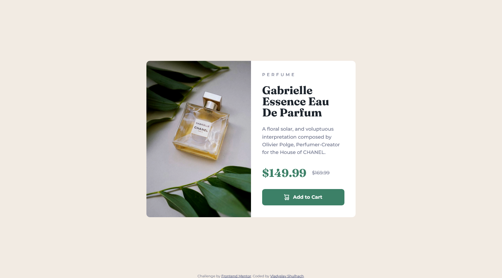

# Frontend Mentor - Product preview card component solution

This project is a solution to the [Product preview card component challenge on Frontend Mentor](https://www.frontendmentor.io/challenges/product-preview-card-component-GO7UmttRfa). Frontend Mentor provides a variety of challenges to help developers practice and improve their coding skills by working on real-world projects. This challenge was a great opportunity to improve my HTML, CSS, and responsive design abilities.

## Table of contents

- [Overview](#overview)
  - [The challenge](#the-challenge)
  - [Screenshot](#screenshot)
  - [Links](#links)
- [My process](#my-process)
  - [Built with](#built-with)
  - [What I learned](#what-i-learned)
  - [Continued development](#continued-development)
  - [Useful resources](#useful-resources)
- [Author](#author)

## Overview

### The challenge

Users should be able to:

- View the optimal layout depending on their device's screen size
- See hover and focus states for interactive elements

### Screenshot

Here is a screenshot of the project displayed on a desktop screen.



### Links

- Solution URL: [Add solution URL here](https://your-solution-url.com)
- Live Site URL: [Add live site URL here](https://your-live-site-url.com)

## My process

### Built with

- Semantic HTML5 markup
- CSS custom properties
- Flexbox
- CSS Grid
- Mobile-first workflow
- SCSS

### What I learned

1. **Mobile-First Methodology**  
   Starting with the mobile layout first made it much easier to build the design incrementally and then expand it for larger screen sizes.

2. **SCSS (Sassy CSS)**  
   I explored SCSS and found it the most effective way to manage styles. SCSS allows for nesting, which simplifies the structure of CSS, especially when combined with BEM. This helped me structure the SCSS code better. It provided clarity and consistency when nesting styles.

3. **Clamp() Function**  
   At first, I was unsure about the purpose of the `clamp()` function and why it didn't behave as expected. Once I had learned more, I was able to grasp its role in responsive layouts. The `min` and `max` values define the boundaries, and the middle value determines how the layout adapts. This is how to use `clamp( )` for responsive design:

   ```scss
   @media (min-width: 21.5rem) {
       .product {
           width: clamp(21.5rem, 70vw + 5rem, 37.5rem);
       }
   }
   ```
   This ensures the card's width adjusts smoothly between 21.5rem and 37.5rem based on the viewport width.

### Continued development

This project has given me a solid understanding of responsive design, SCSS, and modern CSS features. Moving forward, I plan to:

- Responsive design is a big part of modern web development. While this project works well on standard screen sizes, I want to make it even more responsive. This includes optimising layouts for really small screens, like older mobile devices with limited viewport widths, and really large screens, like ultrawide monitors. I'm going to look at techniques like using clamp() more precisely, creating custom breakpoints, and responsive typography to make it all look great and work well on all screen sizes.
  
- SCSS has shown itself to be a great tool for organising and streamlining styles. Going forward, I'll be building on my understanding of SCSS by incorporating mixins, functions and partials into future projects. I'll also be making my stylesheets more structured using partials to make them more scalable in larger projects.
  
- Making sure websites are accessible means that they can be used by everyone, including people with disabilities. I want to improve this project by adding features like ARIA roles to make it easier for screen readers to get the info they need.

### Useful resources

- [Understanding CSS min(), max(), and clamp()](https://web.dev/articles/min-max-clamp) - This resource gave a great explanation of how to use `min()`, `max()`, and `clamp()` effectively for responsive design. The clear examples and interactive animations helped me understand how these functions adjust the layout dynamically.

## Author

- Frontend Mentor - [@yourusername](https://www.frontendmentor.io/profile/yourusername)

